## Creación de un modelo dimensional en Fabric

1. **Creación del warehouse**  
   Dentro de mi workspace `real-time-intelligence`, hice clic en **+ New item** y seleccioné **Warehouse** en la sección **Store Data**. Asigné el nombre **ContosoDW**.  
   Tras unos segundos, el warehouse se creó y se abrió en el navegador mostrando una vista vacía, lista para empezar a trabajar.

   > 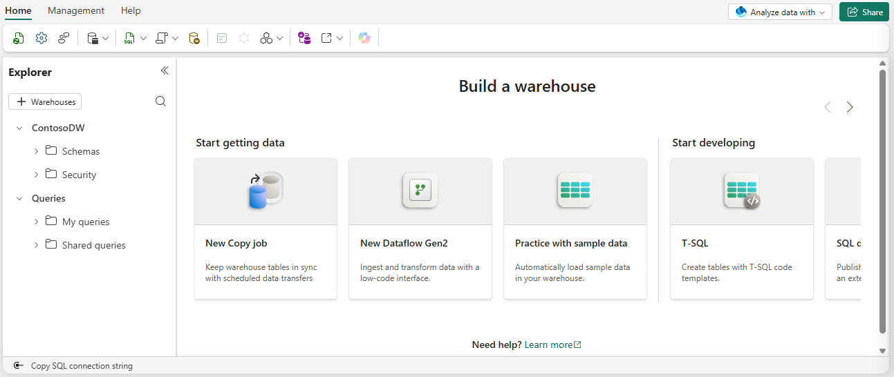

2. **Creación de la tabla de hechos (fact table)**  
   En la barra de herramientas del warehouse, seleccioné **New SQL query** para abrir un editor de consultas.  
   Escribí el siguiente código T‑SQL para definir la tabla `f_Sales`, que almacenará las transacciones de ventas:

"""
CREATE TABLE f_Sales
(
DateKey INT NOT NULL,
StoreKey INT NOT NULL,
ProductKey INT NOT NULL,
CustomerKey INT NOT NULL,
Quantity INT NOT NULL,
UnitPrice DECIMAL(10,2) NOT NULL,
SalesAmount DECIMAL(10,2) NOT NULL,
DiscountAmount DECIMAL(10,2) NOT NULL
);
"""

3. **Ejecución de la consulta**  
Hice clic en el botón **▷ Run** para ejecutar el script. La operación se completó sin errores.

> 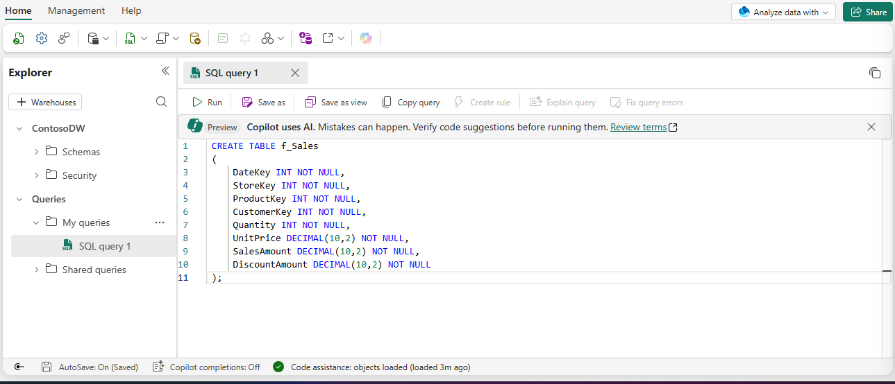

4. **Verificación de la tabla creada**  
Para confirmar que la tabla se había creado correctamente, pulsé el botón **Refresh** en la barra de herramientas para actualizar la vista del explorador.  
Luego, en el panel **Explorer**, expandí la ruta **Schemas > dbo > Tables** y efectivamente apareció la tabla `f_Sales`.

> 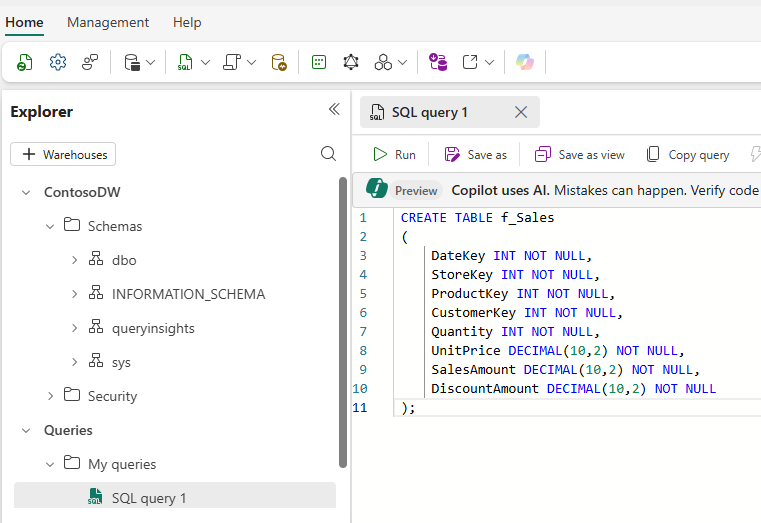

---

**Nota:** La tabla de hechos utiliza el prefijo `f_` para identificarse como tal, y no incluye una clave primaria, siguiendo las buenas prácticas para tablas de hechos en modelos dimensionales.

## Agregar restricciones de tabla (claves primarias y foráneas)

1. **Creación de la consulta SQL para las restricciones**  
   Desde el warehouse `ContosoDW`, abrí una nueva consulta SQL (botón **New SQL query** en la barra de herramientas). En el editor, pegué el siguiente código que agrega las claves primarias a las tablas de dimensiones y las claves foráneas a la tabla de hechos `f_Sales`:

       -- Claves primarias en dimensiones
       ALTER TABLE d_Date
           ADD CONSTRAINT PK_d_Date PRIMARY KEY NONCLUSTERED (DateKey) NOT ENFORCED;

       ALTER TABLE d_Store
           ADD CONSTRAINT PK_d_Store PRIMARY KEY NONCLUSTERED (StoreKey) NOT ENFORCED;

       ALTER TABLE d_Product
           ADD CONSTRAINT PK_d_Product PRIMARY KEY NONCLUSTERED (ProductKey) NOT ENFORCED;

       ALTER TABLE d_Customer
           ADD CONSTRAINT PK_d_Customer PRIMARY KEY NONCLUSTERED (CustomerKey) NOT ENFORCED;

       -- Claves foráneas en la tabla de hechos
       ALTER TABLE f_Sales
           ADD CONSTRAINT FK_Sales_Date FOREIGN KEY (DateKey)
               REFERENCES d_Date(DateKey) NOT ENFORCED;

       ALTER TABLE f_Sales
           ADD CONSTRAINT FK_Sales_Store FOREIGN KEY (StoreKey)
               REFERENCES d_Store(StoreKey) NOT ENFORCED;

       ALTER TABLE f_Sales
           ADD CONSTRAINT FK_Sales_Product FOREIGN KEY (ProductKey)
               REFERENCES d_Product(ProductKey) NOT ENFORCED;

       ALTER TABLE f_Sales
           ADD CONSTRAINT FK_Sales_Customer FOREIGN KEY (CustomerKey)
               REFERENCES d_Customer(CustomerKey) NOT ENFORCED;

2. **Ejecución del script**  
   Hice clic en el botón **▷ Run** para ejecutar todas las instrucciones. La operación se completó sin errores; en el panel de mensajes aparecieron los identificadores de cada declaración confirmando que las restricciones se habían agregado correctamente.

   > 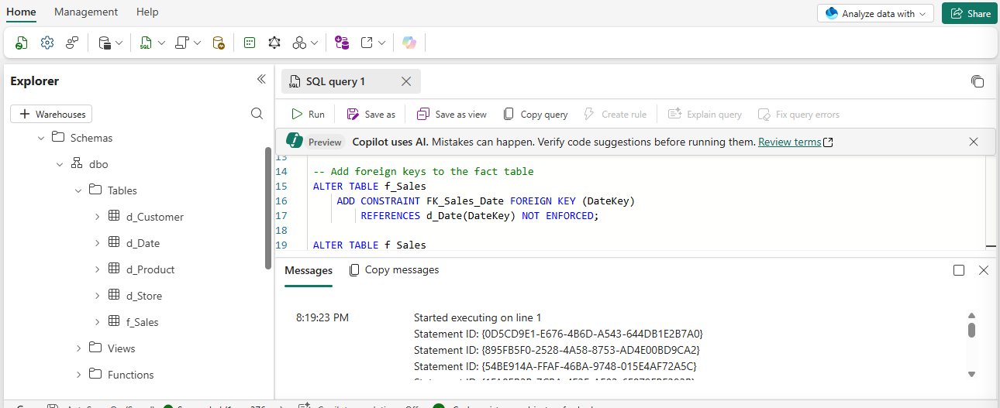

3. **Verificación del esquema**  
   Una vez ejecutado el script, actualicé la vista del explorador (botón **Refresh**) y, aunque las restricciones no son validadas (NOT ENFORCED), quedaron registradas como metadatos que documentan las relaciones entre las tablas. Esto permitirá que, en un futuro, Power BI pueda detectar automáticamente las relaciones al crear un modelo semántico desde el warehouse.

---

**Nota:** Las restricciones `NOT ENFORCED` son típicas en los data warehouses de Fabric, ya que la integridad referencial se gestiona normalmente en los procesos de ETL/ELT y no es necesario que el motor las valide en tiempo de ejecución, pero sí sirven como documentación del modelo estrella.

## Carga de datos de muestra

1. **Creación de una nueva consulta SQL**  
   En el warehouse `ContosoDW`, desde la barra de herramientas, seleccioné **New SQL query** para abrir un editor de consultas.

2. **Inserción de los datos de muestra**  
   En el editor, pegué el siguiente bloque de código que inserta registros en todas las tablas de dimensiones y en la tabla de hechos `f_Sales`:

   ```sql
   -- Carga de la dimensión fecha
   INSERT INTO d_Date VALUES
   (20260105, '2026-01-05', 2026, 1, 1, 'January', 5, 'Monday', 2026, 3, 0, 1),
   (20260112, '2026-01-12', 2026, 1, 1, 'January', 12, 'Monday', 2026, 3, 0, 1),
   (20260209, '2026-02-09', 2026, 1, 2, 'February', 9, 'Monday', 2026, 3, 0, 1),
   (20260302, '2026-03-02', 2026, 1, 3, 'March', 2, 'Monday', 2026, 3, 0, 1),
   (20260406, '2026-04-06', 2026, 2, 4, 'April', 6, 'Monday', 2026, 4, 0, 1),
   (20260504, '2026-05-04', 2026, 2, 5, 'May', 4, 'Monday', 2026, 4, 0, 1);

   -- Carga de la dimensión tienda
   INSERT INTO d_Store VALUES
   (1, 'ST-001', 'Contoso Downtown', 'Flagship', 'Seattle', 'Washington', 'United States', 'West', '2020-03-15', '2026-01-01', '9999-12-31', 1),
   (2, 'ST-002', 'Contoso Mall', 'Standard', 'Portland', 'Oregon', 'United States', 'West', '2021-07-01', '2026-01-01', '9999-12-31', 1),
   (3, 'ST-003', 'Contoso Central', 'Standard', 'Chicago', 'Illinois', 'United States', 'Central', '2019-11-20', '2026-01-01', '9999-12-31', 1),
   (4, 'ST-004', 'Contoso Plaza', 'Express', 'New York', 'New York', 'United States', 'East', '2022-01-10', '2026-01-01', '9999-12-31', 1);

   -- Carga de la dimensión producto
   INSERT INTO d_Product VALUES
   (1, 'MB-PRO', 'Mountain Bike Pro', 'AdventureWorks', 'Mountain Bikes', 'Bikes', 1200.00, '2026-01-01', '9999-12-31', 1),
   (2, 'RB-ELT', 'Road Bike Elite', 'AdventureWorks', 'Road Bikes', 'Bikes', 900.00, '2026-01-01', '9999-12-31', 1),
   (3, 'HL-STD', 'Cycling Helmet', 'SafeRide', 'Helmets', 'Accessories', 25.00, '2026-01-01', '9999-12-31', 1),
   (4, 'WB-STD', 'Water Bottle', 'HydroGear', 'Bottles', 'Accessories', 5.00, '2026-01-01', '9999-12-31', 1),
   (5, 'LK-STD', 'Bike Lock', 'SecureLock', 'Locks', 'Accessories', 15.00, '2026-01-01', '9999-12-31', 1);

   -- Carga de la dimensión cliente
   INSERT INTO d_Customer VALUES
   (1, 'Jordan Rivera', 'Premium', 'Seattle', 'Washington', 'United States', 'Gold', '2023-06-15'),
   (2, 'Alex Chen', 'Standard', 'Portland', 'Oregon', 'United States', 'Silver', '2024-01-20'),
   (3, 'Sam Patel', 'Premium', 'Chicago', 'Illinois', 'United States', 'Gold', '2022-11-05'),
   (4, 'Taylor Kim', 'Budget', 'New York', 'New York', 'United States', 'Bronze', '2025-03-12'),
   (5, 'Morgan Lee', 'Standard', 'Seattle', 'Washington', 'United States', 'Silver', '2024-08-30');

   -- Carga de la tabla de hechos (ventas)
   INSERT INTO f_Sales VALUES
   (20260105, 1, 1, 1, 1, 1500.00, 1500.00, 0.00),
   (20260105, 1, 3, 1, 2, 35.00, 70.00, 5.00),
   (20260112, 2, 2, 2, 1, 1100.00, 1100.00, 100.00),
   (20260112, 2, 4, 2, 3, 8.00, 24.00, 0.00),
   (20260209, 3, 1, 3, 2, 1500.00, 3000.00, 150.00),
   (20260209, 3, 5, 3, 1, 22.00, 22.00, 0.00),
   (20260302, 1, 2, 5, 1, 1100.00, 1100.00, 0.00),
   (20260302, 4, 3, 4, 4, 35.00, 140.00, 10.00),
   (20260406, 2, 1, 2, 1, 1500.00, 1500.00, 75.00),
   (20260504, 3, 4, 3, 5, 8.00, 40.00, 0.00);

3. **Ejecución de la carga**  
Hice clic en el botón ▷ Run para ejecutar el script. La operación se completó correctamente; en el panel de mensajes se confirmó que se habían insertado los registros en cada tabla, mostrando el número de filas afectadas (por ejemplo, 6 registros en la tabla de hechos y las respectivas inserciones en las dimensiones).

3. **Verificación de los datos**
Para confirmar que los datos se cargaron adecuadamente, actualicé la vista del explorador (botón Refresh) y verifiqué que las tablas ya contenían los registros insertados. También ejecuté una consulta rápida de selección sobre f_Sales para visualizar las primeras filas y confirmar que los valores coincidían con los insertados.

> 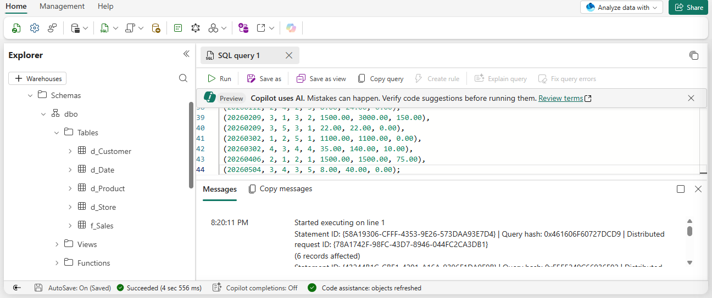


## Consulta del esquema estrella

1. **Consulta de ventas por mes y categoría de producto**  
   En el warehouse `ContosoDW`, creé una nueva consulta SQL (botón **New SQL query**) y escribí el siguiente código para analizar las ventas agrupadas por mes y categoría:

   """
   SELECT
d.MonthName,
p.Category,
SUM(f.SalesAmount) AS TotalSales,
SUM(f.Quantity) AS TotalQuantity,
SUM(f.DiscountAmount) AS TotalDiscounts
FROM f_Sales f
JOIN d_Date d ON f.DateKey = d.DateKey
JOIN d_Product p ON f.ProductKey = p.ProductKey
GROUP BY d.MonthName, d.[Month], p.Category
ORDER BY d.[Month], p.Category;
   """

Ejecuté la consulta con el botón **▷ Run** y obtuve los resultados esperados: ventas totales, cantidades y descuentos agrupados por mes y categoría. Se observó que la tabla de hechos se une a las dimensiones para obtener atributos descriptivos, y las funciones `SUM` agregan las medidas numéricas.

2. **Consulta de ventas por región de tienda y segmento de cliente**  
A continuación, creé otra consulta SQL (en una nueva pestaña) para cambiar el enfoque del análisis, utilizando las dimensiones `d_Store` y `d_Customer`. El código fue el siguiente:

"""
SELECT
s.Region,
c.Segment,
SUM(f.SalesAmount) AS TotalSales,
COUNT(*) AS TransactionCount
FROM f_Sales f
JOIN d_Store s ON f.StoreKey = s.StoreKey
JOIN d_Customer c ON f.CustomerKey = c.CustomerKey
GROUP BY s.Region, c.Segment
ORDER BY s.Region, c.Segment;
"""


Al ejecutarla, los resultados mostraron las ventas totales y el número de transacciones desglosadas por región y segmento de cliente. Esta consulta demuestra la flexibilidad del modelo estrella: sin modificar el esquema subyacente, puedo obtener diferentes perspectivas de negocio simplemente cambiando las dimensiones en los `JOIN` y en el `GROUP BY`.

> 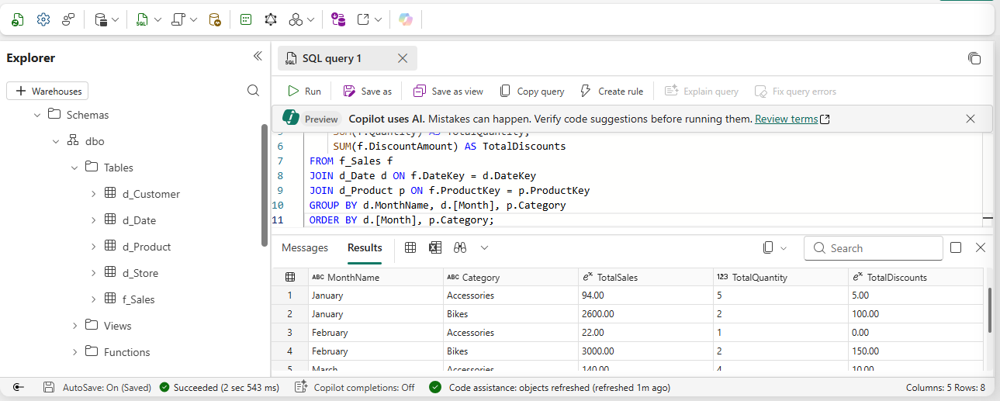

---

**Nota:** Ambas consultas confirman que el modelo dimensional permite analizar los datos de ventas desde múltiples ejes (tiempo, producto, ubicación, cliente) y que las medidas (SalesAmount, Quantity, DiscountAmount) se agregan correctamente según las dimensiones seleccionadas.


## Cambio SCD

### 1. Simular un cambio SCD Tipo 2 (actualización de costo del producto)
Supuse que el costo de la bicicleta "Mountain Bike Pro" aumenta de $1,200 a $1,350 a partir del 1 de marzo de 2026. Para implementar el SCD Tipo 2, ejecuté los siguientes pasos en una nueva consulta SQL:

- **Paso 1:** Expirar la versión actual del producto, estableciendo `ValidTo = '2026-03-01'` y `IsCurrent = 0`.

"""
UPDATE d_Product
SET ValidTo = '2026-03-01',
IsCurrent = 0
WHERE ProductNaturalKey = 'MB-PRO'
AND IsCurrent = 1;
"""

- **Paso 2:** Insertar la nueva versión del producto con el costo actualizado ($1350) y la nueva fecha de vigencia (`ValidFrom = '2026-03-01'`).

"""
INSERT INTO d_Product VALUES
(6, 'MB-PRO', 'Mountain Bike Pro', 'AdventureWorks', 'Mountain Bikes', 'Bikes', 1350.00, '2026-03-01', '9999-12-31', 1);
"""

- **Paso 3:** Agregar una transacción de venta que haga referencia a la nueva versión del producto (ProductKey = 6).

"""
INSERT INTO f_Sales VALUES
(20260504, 1, 6, 5, 1, 1500.00, 1500.00, 0.00);
"""

La ejecución de estos pasos se completó sin errores, como se muestra en los mensajes de la consulta.  
> 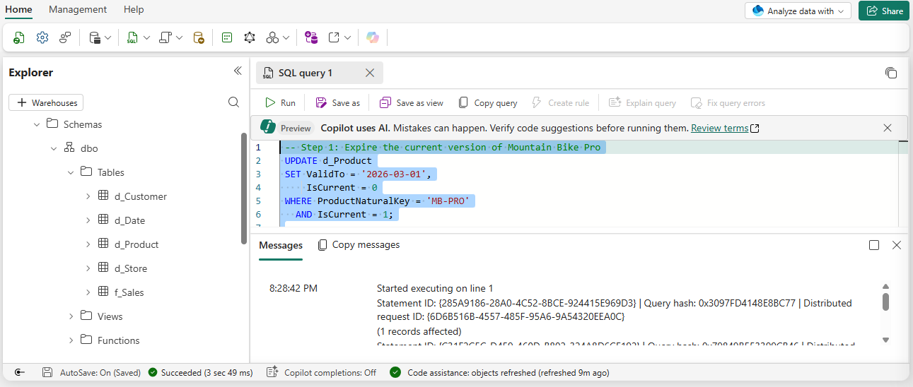)

### 2. Verificar la trazabilidad histórica del SCD Tipo 2
Para comprobar que las ventas anteriores conservan el costo original y la nueva venta refleja el costo actualizado, ejecuté una consulta que une las tablas de hechos, fecha y producto, filtrando por el identificador natural del producto:

"""
SELECT
d.FullDate,
p.ProductName,
p.UnitCost AS ProductCostVersion,
p.ValidFrom AS CostEffectiveDate,
f.Quantity,
f.SalesAmount
FROM f_Sales f
JOIN d_Date d ON f.DateKey = d.DateKey
JOIN d_Product p ON f.ProductKey = p.ProductKey
WHERE p.ProductNaturalKey = 'MB-PRO'
ORDER BY d.FullDate;
"""

Los resultados mostraron que las ventas de enero, febrero y abril conservan el costo de $1,200, mientras que la venta de mayo (después del cambio) utiliza el nuevo costo de $1,350. Esto confirma que el SCD Tipo 2 preserva la precisión histórica.  
> 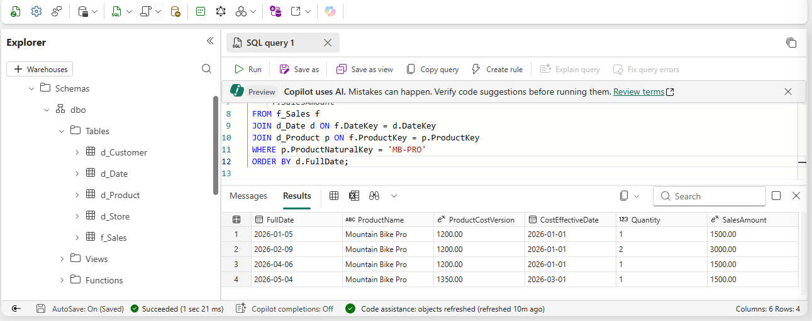

### 3. Simular un cambio SCD Tipo 1 (corrección de nombre de producto)
A continuación, simulé un cambio en el nombre del producto "Water Bottle" a "Insulated Water Bottle". Para ello, ejecuté una actualización directa que sobrescribe el valor existente, sin conservar historial:

"""
UPDATE d_Product
SET ProductName = 'Insulated Water Bottle'
WHERE ProductNaturalKey = 'WB-STD';
"""

La operación afectó una fila, como se muestra en los mensajes de la consulta.  
> 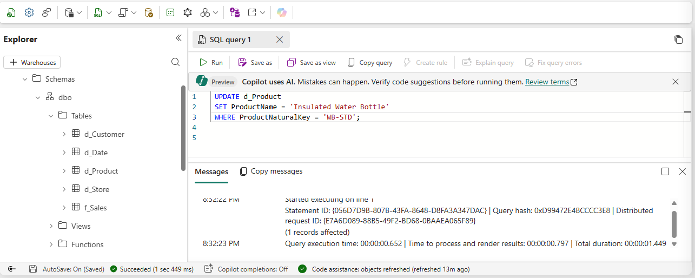

### 4. Verificar ambos cambios SCD en la tabla de productos
Para confirmar que ambos patrones se aplicaron correctamente, ejecuté una consulta que muestra todas las filas de la tabla `d_Product`, ordenadas por clave natural y fecha de vigencia:
"""
SELECT ProductKey, ProductNaturalKey, ProductName, UnitCost, ValidFrom, ValidTo, IsCurrent
FROM d_Product
ORDER BY ProductNaturalKey, ValidFrom;
"""

Los resultados evidencian que:

- El producto `MB-PRO` tiene dos registros: la versión expirada (ProductKey = 1, costo $1,200, ValidTo = 2026-03-01, IsCurrent = 0) y la versión actual (ProductKey = 6, costo $1,350, IsCurrent = 1). Esto corresponde al SCD Tipo 2.
- El producto `WB-STD` tiene un solo registro con el nombre actualizado "Insulated Water Bottle"; el nombre original se perdió, lo que corresponde al SCD Tipo 1.

> 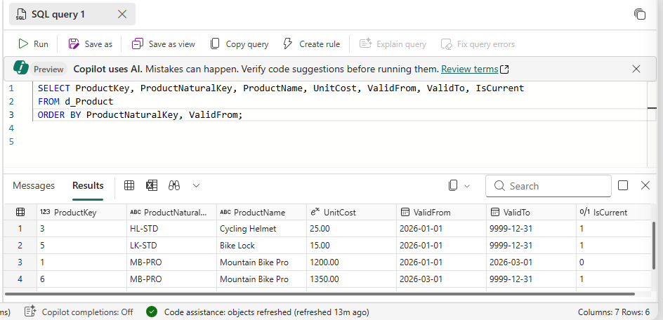

---

**Nota:** La implementación de estos patrones SCD permite gestionar los cambios en los atributos de las dimensiones de manera que se mantenga la integridad histórica (Tipo 2) o se simplifique la corrección de datos (Tipo 1), según los requisitos del negocio.

## Verificación del diseño dimensional

1. **Consulta integral del modelo estrella**  
   Para validar que el esquema dimensional funciona correctamente, creé una nueva consulta SQL en el warehouse `ContosoDW` y escribí el siguiente código, que une la tabla de hechos `f_Sales` con las cuatro tablas de dimensiones:

"""
SELECT
d.FullDate,
d.[Year],
d.MonthName,
s.StoreName,
s.Region,
p.ProductName,
p.Category,
c.CustomerName,
c.Segment,
f.Quantity,
f.UnitPrice,
f.SalesAmount,
f.DiscountAmount
FROM f_Sales f
JOIN d_Date d ON f.DateKey = d.DateKey
JOIN d_Store s ON f.StoreKey = s.StoreKey
JOIN d_Product p ON f.ProductKey = p.ProductKey
JOIN d_Customer c ON f.CustomerKey = c.CustomerKey
ORDER BY d.FullDate, s.StoreName;
"""


Ejecuté la consulta con el botón **▷ Run** y obtuve un conjunto de resultados que mostraba todas las transacciones enriquecidas con los atributos de las dimensiones.  
> 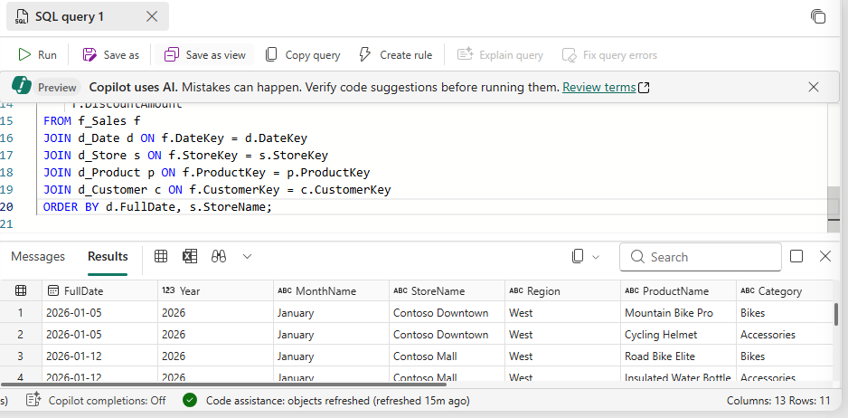

2. **Verificación de los ejes de análisis**  
Revisé los resultados y confirmé que el modelo permite analizar los datos desde múltiples perspectivas:

- **Análisis temporal:** La dimensión `d_Date` permite agrupar por año, trimestre, mes y día.
- **Análisis geográfico:** La dimensión `d_Store` proporciona la jerarquía Región > País > Estado > Ciudad.
- **Análisis de producto:** La dimensión `d_Product` permite agrupar por Categoría > Subcategoría > Marca > Producto.
- **Análisis de cliente:** La dimensión `d_Customer` habilita la segmentación por segmento y nivel de lealtad.

3. **Consultas adicionales para validar diferentes perspectivas**  
Para asegurarme de que todas las dimensiones funcionaban correctamente, ejecuté consultas adicionales que mostraban agregaciones específicas:

- **Ventas por año, trimestre y mes:**  
"""
SELECT
d.Year,
d.Quarter,
d.MonthName,
COUNT(*) AS NumVentas,
SUM(f.SalesAmount) AS TotalVentas
FROM f_Sales f
JOIN d_Date d ON f.DateKey = d.DateKey
GROUP BY d.Year, d.Quarter, d.MonthName
ORDER BY d.Year, d.Quarter, d.MonthName;
"""

Los resultados confirmaron la correcta agregación temporal.  
> 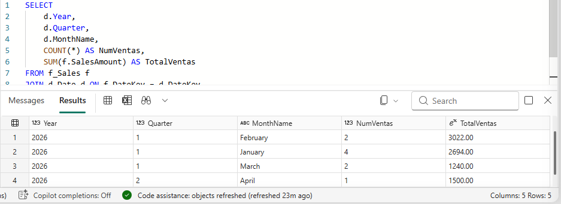

- **Ventas por ubicación geográfica (Región, País, Estado, Ciudad):**  

"""
SELECT
s.Region,
s.Country,
s.State,
s.City,
SUM(f.SalesAmount) AS TotalVentas
FROM f_Sales f
JOIN d_Store s ON f.StoreKey = s.StoreKey
GROUP BY s.Region, s.Country, s.State, s.City
ORDER BY s.Region, s.Country, s.State, s.City;
"""
Los resultados mostraron el desglose geográfico de las ventas.  
> 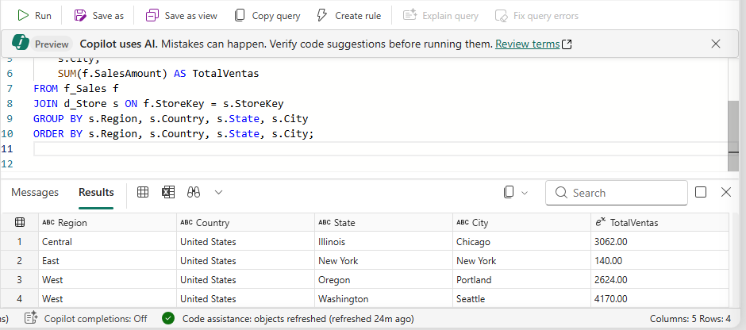

- **Ventas por categoría de producto (Categoría, Subcategoría, Marca, Producto):**  

"""
SELECT
p.Category,
p.Subcategory,
p.Brand,
p.ProductName,
SUM(f.SalesAmount) AS TotalVentas
FROM f_Sales f
JOIN d_Product p ON f.ProductKey = p.ProductKey
GROUP BY p.Category, p.Subcategory, p.Brand, p.ProductName
ORDER BY p.Category, p.Subcategory, p.Brand, p.ProductName;
"""
Los resultados reflejaron las ventas por jerarquía de producto.  
> 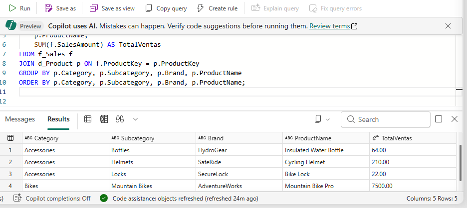

- **Ventas por segmento y nivel de lealtad del cliente:**  

Los resultados evidenciaron el comportamiento de compra por segmento.  
> 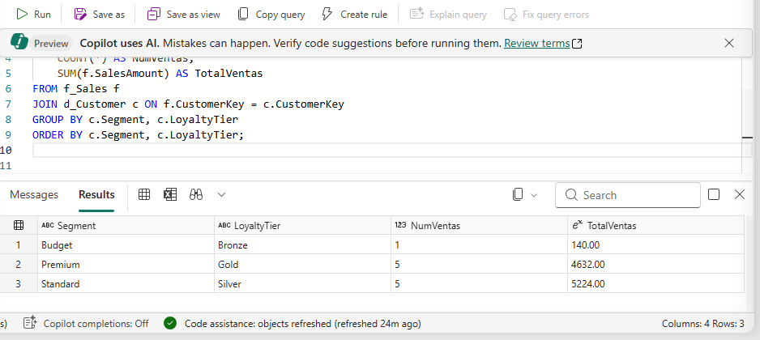

4. **Resumen del diseño verificado**  
Con todas las consultas ejecutadas y los resultados revisados, confirmé que el modelo cumple con los requisitos del diseño dimensional:

- **Esquema:** Estrella (una tabla de hechos `f_Sales` y cuatro dimensiones: `d_Date`, `d_Store`, `d_Product`, `d_Customer`).
- **Grano:** Una fila por cada línea de transacción de venta.
- **Medidas:** 
- *Aditivas:* `Quantity`, `SalesAmount`, `DiscountAmount` (se pueden sumar en cualquier dimensión).
- *No aditiva:* `UnitPrice` (debe promediarse o usarse en cálculos, no sumarse directamente).
- **Jerarquías:** Fecha (Año > Trimestre > Mes > Día), Tienda (Región > País > Estado > Ciudad), Producto (Categoría > Subcategoría > Marca > Producto).
- **SCD:** Tipo 2 para el costo del producto (UnitCost) y Tipo 1 para el nombre del producto (ProductName) y todos los atributos del cliente (en este ejercicio). La dimensión de tienda también incluye columnas preparadas para SCD Tipo 2.

---

**Nota:** El modelo dimensional queda validado y listo para su uso en análisis posteriores, incluyendo la creación de modelos semánticos en Power BI, donde las restricciones `NOT ENFORCED` servirán como metadatos para detectar relaciones automáticamente.


