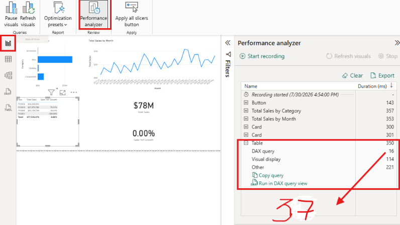

# Optimize semantic model performance

En este ejercicio, mi objetivo fue aprender a diagnosticar y solucionar problemas de rendimiento en un modelo semántico de Power BI. El archivo `16-Starter-Sales Analysis.pbix`, basado en datos de AdventureWorks, contenía medidas con patrones DAX ineficientes de forma intencionada. 
[archivo de descarga](16-Starter-Sales%20Analysis.pbix)

A lo largo del laboratorio, aprendí a usar el **Analizador de rendimiento**, a analizar consultas DAX generadas, a optimizar patrones repetitivos con variables (`VAR`), a examinar la cardinalidad de las columnas y a verificar las mejoras aplicadas.

## 1. Capturar una línea base de rendimiento

Mi primer paso fue abrir el archivo `.pbix` y, en la pestaña **Optimize** (Optimizar) de la cinta de opciones, seleccionar la herramienta **Performance analyzer** (Analizador de rendimiento).


*[Nota: Pantalla mostrando la pestaña "Optimize" con el recuadro de "Performance analyzer"]*

Esto abrió un panel a la derecha del lienzo. Para establecer mi línea base de rendimiento, hice clic en **Start recording** (Iniciar grabación), luego en **Refresh visuals** (Actualizar objetos visuales) para recargar todos los gráficos de la página y, tras esperar unos segundos, en **Stop** (Detener).


*[Nota: El panel del Performance analyzer con los botones Start recording, Refresh visuals y Stop, y la lista de objetos visuales con sus tiempos de duración en ms]*

## 2. Analizar la consulta DAX del visual más lento

Una vez obtenida la línea base, expandí el registro correspondiente al objeto visual de **Table** (Tabla) situado en la parte inferior izquierda del informe.


*[Nota: El objeto visual Table resaltado a la izquierda y el panel del analizador mostrando la opción "Run in DAX query view"]*

Dentro de las opciones del objeto visual, seleccioné **Run in DAX query view** (Ejecutar en la vista de consultas DAX). Power BI me abrió automáticamente una nueva ventana con el código DAX generado en segundo plano para dibujar esa tabla.


*[Nota: El editor DAX mostrando el código autogenerado con SUMMARIZECOLUMNS, ROLLUPADDISSUBTOTAL y TOPN, y los resultados de la consulta abajo]*

El código generado era el siguiente:
```dax
DEFINE
    VAR __DS0Core = 
        SUMMARIZECOLUMNS(
            ROLLUPADDISSUBTOTAL('Date'[Year], "IsGrandTotalRowTotal"),
            "Total_Sales", 'Sales'[Total Sales],
            "Sales_YoY_Growth", 'Sales'[Sales YoY Growth]
        )

    VAR __DS0PrimaryWindowed = 
        TOPN(502, __DS0Core, [IsGrandTotalRowTotal], 0, 'Date'[Year], 1)

EVALUATE
    __DS0PrimaryWindowed

ORDER BY
    [IsGrandTotalRowTotal] DESC, 'Date'[Year]
```
Observé que este código utilizaba SUMMARIZECOLUMNS para agrupar los datos y TOPN para limitar las filas, pero no contenía la lógica real de las medidas, solo las referenciaba por su nombre. Esto me indicaba que el problema real estaba en la definición de la medida llamada Sales YoY Growth.

## 3. Identificar el patrón ineficiente en la medida

Regresé a la Vista Informe. En el panel de Datos, expandí la tabla Sales y seleccioné la medida Sales YoY Growth. Su definición apareció en la barra de fórmulas.


[Nota: Se observa el analizador de rendimiento y el resaltado de "Run in DAX query view"]


[Nota: La barra de fórmulas mostrando la medida con un DIVIDE y dos CALCULATE repetidos]

Al leer la fórmula, detecté un patrón ineficiente de subexpresión repetida:


````
Sales YoY Growth =
 DIVIDE(
     [Total Sales] - CALCULATE([Total Sales], SAMEPERIODLASTYEAR('Date'[Date])),
     CALCULATE([Total Sales], SAMEPERIODLASTYEAR('Date'[Date]))
 )

````
El motor de DAX evaluaba CALCULATE([Total Sales], SAMEPERIODLASTYEAR('Date'[Date])) dos veces por cada fila de la tabla: una en el numerador y otra en el denominador. Esto era claramente un desperdicio de recursos.

## 4. Optimizar la medida con variables DAX

Mi siguiente acción fue reescribir la medida utilizando buenas prácticas de DAX: almacenar el resultado en una variable (VAR) para calcularla solo una vez.


[Nota: La barra de fórmulas con el código optimizado usando VAR SalesPriorYear y RETURN]

Reemplacé el código anterior por el siguiente:

````
Sales YoY Growth =
 VAR SalesPriorYear =
     CALCULATE([Total Sales], SAMEPERIODLASTYEAR('Date'[Date]))
 RETURN
     DIVIDE([Total Sales] - SalesPriorYear, SalesPriorYear)
````
Ahora, el cálculo del año anterior se realizaba una única vez, se almacenaba en SalesPriorYear y se reutilizaba las veces que fuera necesario en el resultado final.

## 5. Verificar la integridad de los resultados
Antes de celebrar la optimización, debía asegurarme de que los datos seguían siendo correctos.


[Nota: La ventana DAX Query View ejecutando una consulta simple y el resultado mostrando 0.7, 0.18, -1]

En la Vista de consultas DAX, abrí una nueva pestaña y ejecuté el siguiente código de prueba:

````
EVALUATE
SUMMARIZECOLUMNS(
    'Date'[Year],
    "YoY Growth", [Sales YoY Growth]
)

````
Los resultados arrojaron 0.7 para FY2019, 0.18 para FY2020 y -1 para FY2021. Estos valores coincidían exactamente con los que había visto antes de la optimización. La fórmula era más rápida y los resultados, correctos.

## 6. Examinar la cardinalidad de las columnas

El laboratorio me enseñó que el rendimiento no solo depende del DAX, sino también de la estructura del modelo. Columnas con altos valores únicos (alta cardinalidad) comprimen mal y consumen mucha memoria.


[Nota: El código COLUMNSTATISTICS() en DAX Query View]

Ejecuté la siguiente consulta DAX en una nueva pestaña:
````
DEFINE
    VAR _stats = COLUMNSTATISTICS()
EVALUATE
    FILTER(_stats, NOT CONTAINSSTRING([Column Name], "RowNumber-"))
ORDER BY [Cardinality] DESC

````

[Nota: La tabla de resultados mostrando la cardinalidad de las columnas, encabezada por SalesOrderNumber con 3616]

Al revisar los resultados, la tabla de hechos Sales dominaba la lista. La columna SalesOrderNumber tenía la mayor cardinalidad (3,616 valores distintos), y la columna Date de la tabla calendario le seguía de cerca. Esto me confirmó que las tablas de hechos son las que más impactan en la memoria y el rendimiento general del modelo.

## 7. Confirmar la mejora de rendimiento (Antes vs Después)

Para finalizar el laboratorio, volví al Analizador de rendimiento para confirmar numéricamente mi éxito.


[Nota: El panel del analizador de rendimiento mostrando el tiempo de consulta DAX reducido a 16ms, señalado con una flecha]

Limpié el registro previo, inicié una nueva grabación y actualicé los objetos visuales. Al expandir la entrada de la Table, los resultados fueron contundentes:

Antes (Línea base - ver Imagen 2): El tiempo de la consulta DAX era de 37 ms (con un tiempo total de visualización de 208 ms).

Después (Optimizado - ver Imagen 11): El tiempo de la consulta DAX se desplomó a solo 16 ms (con un tiempo total de visualización de 350 ms).

A pesar de que el conjunto de datos no es masivo, la reducción a la mitad del tiempo de consulta DAX demostró la eficacia de eliminar las subexpresiones repetidas. El flujo de trabajo medir → diagnosticar → corregir → verificar quedó completamente consolidado en mi aprendizaje.

