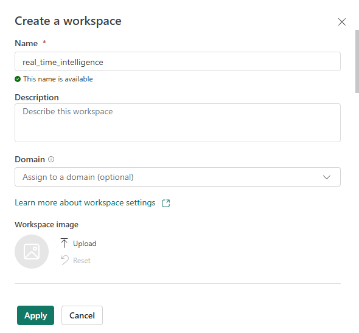
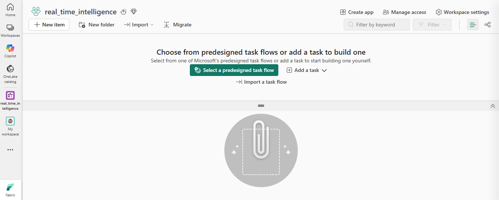
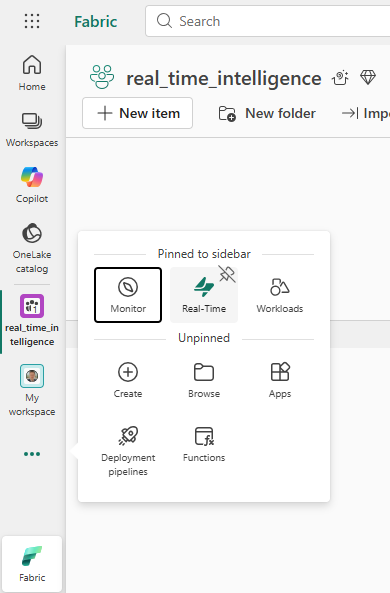
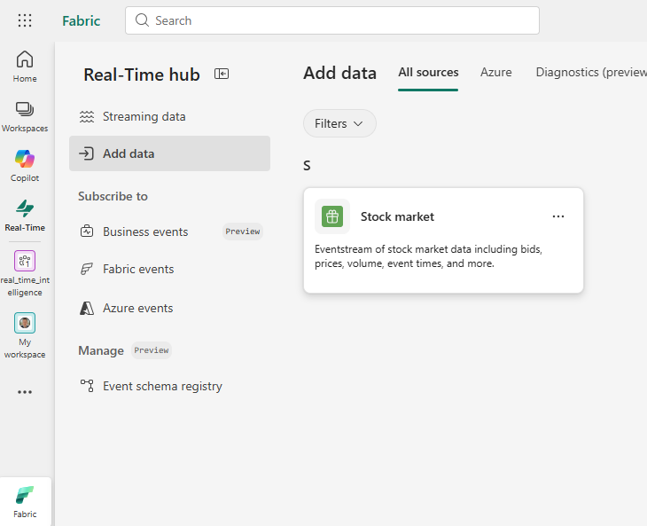
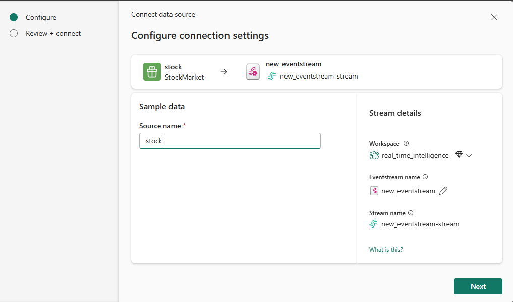
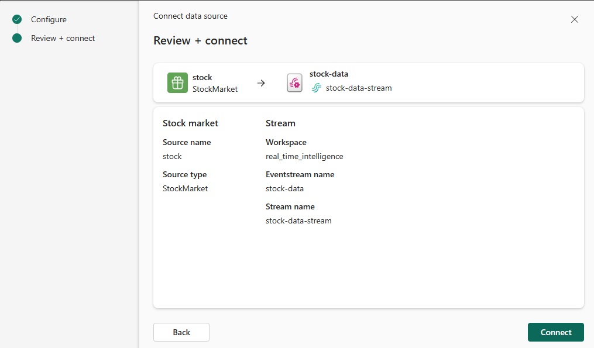
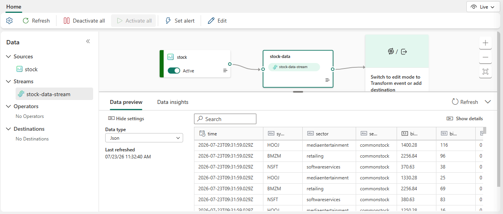

# Laboratorio: real time intelligence

## Requisitos previos
- Disponer de acceso a una capacidad de Fabric de pago o de prueba (trial).  
- Contar con un inquilino (tenant) de Microsoft Fabric.

---

## Desarrollo del laboratorio

1. **Acceso a la plataforma**  

2. **Creación de un nuevo workspace**  
   Dentro de la sección de workspaces, elegí la opción de crear un nuevo workspace. Asigné el nombre **`real_time_intelligence`** (un nombre a elección, tal como se indica en el laboratorio).  
   Complete los campos adicionales:  
   - **Descripción**: escribí una breve descripción para identificar el propósito del workspace.  
   - **Dominio**: dejé este campo opcional sin asignar.  
   - **Imagen del workspace**: mantuve la imagen por defecto (no cargué ninguna).  

   Seleccioné un modo de licencia que incluyera capacidad de Fabric (en mi caso, elegí la opción **Trial** para la prueba).  
   Finalmente, hice clic en **Apply** para confirmar la creación. 

   > 

3. **Verificación del workspace vacío**  
   Una vez creado, el workspace se abrió automáticamente. Tal como se esperaba, se mostró completamente vacío, sin elementos ni tareas predefinidas.  
   En la interfaz pude observar las opciones para agregar nuevos elementos, carpetas, importar o migrar, así como la posibilidad de elegir flujos de tareas prediseñados o añadir tareas personalizadas.

# Creación de un eventstream

1. **Acceso al Real‑Time Hub**  
   Desde el workspace `real_time_intelligence` que creé anteriormente, localicé en la barra lateral izquierda el icono de **Real‑Time hub** (si no aparecía, lo fijé usando el botón de puntos suspensivos).  
   > 

2. **Inicio de la adición de datos**  
   Dentro del Real‑Time Hub, hice clic en el botón **Add data** para comenzar a incorporar una fuente de streaming.  
   > 

3. **Selección de la fuente de muestra**  
   Entre las opciones disponibles, elegí el origen de datos de muestra **Stock market**, que proporciona datos bursátiles en tiempo real.

4. **Configuración de la conexión**  
   En el panel de configuración, completé los campos tal como se indicaba:  
   - **Source name**: `stock`  
   - **Workspace**: seleccioné `real_time_intelligence` (el que había creado)  
   - **Eventstream name**: `stock-data`  
   - El nombre del stream asociado se generó automáticamente como `stock-data-stream`.  
   >   
   > 

5. **Conexión y creación del eventstream**  
   Revisé los datos y pulsé **Next**, luego **Connect** para crear el eventstream.  
   Una vez finalizado, seleccioné **Open eventstream** para visualizar el flujo en el lienzo de diseño.

6. **Resultado final**  
   El eventstream se mostró correctamente en el canvas, con el origen `stock` y el stream `stock-data-stream` listos para ser utilizados en transformaciones o enrutamientos.  
   > 

---
**Nota:** Con este eventstream ya tengo una fuente de datos en tiempo real sobre la que podré aplicar procesamientos posteriores.

## Creación del Eventhouse

1. **Creación del Eventhouse**  
   En la barra lateral izquierda, seleccioné **Create** (si no estaba visible, lo fijé con el botón de puntos suspensivos). Dentro de la sección **Real‑Time Intelligence**, elegí **Eventhouse** y le asigné el nombre **`stock-house`**.  
   Cerré los mensajes de bienvenida hasta que apareció el Eventhouse vacío.

   > 

2. **Exploración inicial**  
   En el panel izquierdo observé que mi Eventhouse contenía una base de datos KQL con el mismo nombre (`stock-house`) y un **queryset** asociado con consultas de muestra.  
   Seleccioné la base de datos y comprobé que aún no había tablas, por lo que procedí a ingerir datos desde el eventstream.

3. **Inicio de la ingesta de datos**  
   En la página principal de la base de datos KQL, hice clic en **Get data**.  
   > 

4. **Configuración de la fuente**  
   Como origen elegí **Eventstream > Existing eventstream**. En el panel **Select or create a destination table**, creé una nueva tabla con el nombre **`stock`**.  
   Luego, en **Configure the data source**, seleccioné mi workspace `real_time_intelligence`, el eventstream `stock-data` y el stream `stock-data-stream`. Asigné el nombre **`stock-table`** a la conexión de datos.  
   > 

5. **Finalización y verificación**  
   Usé el botón **Next** para inspeccionar los datos y completar la configuración. Cerré la ventana y, al volver al Eventhouse, la tabla **`stock`** ya aparecía listada.  
   > 

6. **Confirmación en el Real‑Time Hub**  
   Para verificar que el eventstream ahora tenía un destino, fui al **Real‑Time hub**, abrí el menú de opciones del stream `stock-data-stream` y seleccioné **Open eventstream**. En el lienzo de diseño, el stream mostraba un nodo de destino hacia la tabla.  
   Actualicé la vista y comprobé que los datos estaban fluyendo correctamente.  
   > 

---

**Nota:** Con este Eventhouse ya tengo almacenados los datos en tiempo real en una tabla, lista para ser consultada y analizada con KQL.

