# Laboratorio: real time intelligence

## Requisitos previos
- Disponer de acceso a una capacidad de Fabric de pago o de prueba (trial).  
- Contar con un inquilino (tenant) de Microsoft Fabric.

---

## Desarrollo del laboratorio

1. **Acceso a la plataforma**  

2. **Creación de un nuevo workspace**  
   Dentro de la sección de workspaces, elegí la opción de crear un nuevo workspace. Asigné el nombre **`real_time_intelligence`** (un nombre a elección, tal como se indica en el laboratorio).  
   Complete los campos adicionales:  
   - **Descripción**: escribí una breve descripción para identificar el propósito del workspace.  
   - **Dominio**: dejé este campo opcional sin asignar.  
   - **Imagen del workspace**: mantuve la imagen por defecto (no cargué ninguna).  

   Seleccioné un modo de licencia que incluyera capacidad de Fabric (en mi caso, elegí la opción **Trial** para la prueba).  
   Finalmente, hice clic en **Apply** para confirmar la creación. 

   > 

3. **Verificación del workspace vacío**  
   Una vez creado, el workspace se abrió automáticamente. Tal como se esperaba, se mostró completamente vacío, sin elementos ni tareas predefinidas.  
   En la interfaz pude observar las opciones para agregar nuevos elementos, carpetas, importar o migrar, así como la posibilidad de elegir flujos de tareas prediseñados o añadir tareas personalizadas.

# Creación de un eventstream

1. **Acceso al Real‑Time Hub**  
   Desde el workspace `real_time_intelligence` que creé anteriormente, localicé en la barra lateral izquierda el icono de **Real‑Time hub** (si no aparecía, lo fijé usando el botón de puntos suspensivos).  
   > 

2. **Inicio de la adición de datos**  
   Dentro del Real‑Time Hub, hice clic en el botón **Add data** para comenzar a incorporar una fuente de streaming.  
   > 

3. **Selección de la fuente de muestra**  
   Entre las opciones disponibles, elegí el origen de datos de muestra **Stock market**, que proporciona datos bursátiles en tiempo real.

4. **Configuración de la conexión**  
   En el panel de configuración, completé los campos tal como se indicaba:  
   - **Source name**: `stock`  
   - **Workspace**: seleccioné `real_time_intelligence` (el que había creado)  
   - **Eventstream name**: `stock-data`  
   - El nombre del stream asociado se generó automáticamente como `stock-data-stream`.  
   >   
   > 

5. **Conexión y creación del eventstream**  
   Revisé los datos y pulsé **Next**, luego **Connect** para crear el eventstream.  
   Una vez finalizado, seleccioné **Open eventstream** para visualizar el flujo en el lienzo de diseño.

6. **Resultado final**  
   El eventstream se mostró correctamente en el canvas, con el origen `stock` y el stream `stock-data-stream` listos para ser utilizados en transformaciones o enrutamientos.  
   > 

---
**Nota:** Con este eventstream ya tengo una fuente de datos en tiempo real sobre la que podré aplicar procesamientos posteriores.

## Creación del Eventhouse

1. **Creación del Eventhouse**  
   En la barra lateral izquierda, seleccioné **Create** (si no estaba visible, lo fijé con el botón de puntos suspensivos). Dentro de la sección **Real‑Time Intelligence**, elegí **Eventhouse** y le asigné el nombre **`stock-house`**.  
   Cerré los mensajes de bienvenida hasta que apareció el Eventhouse vacío.

   > 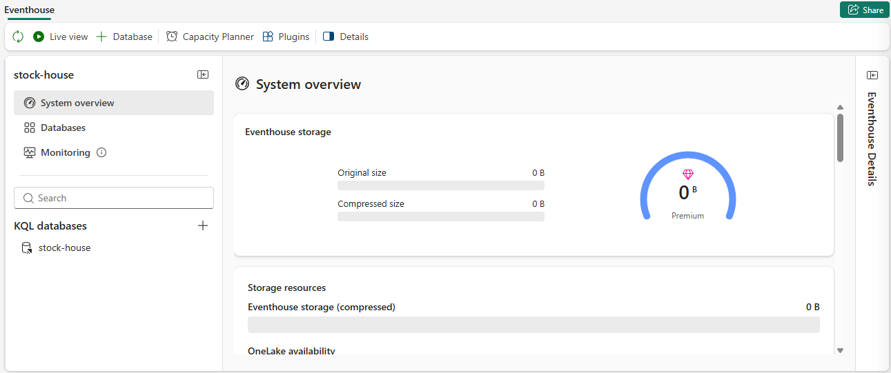

2. **Exploración inicial**  
   En el panel izquierdo observé que mi Eventhouse contenía una base de datos KQL con el mismo nombre (`stock-house`) y un **queryset** asociado con consultas de muestra.  
   Seleccioné la base de datos y comprobé que aún no había tablas, por lo que procedí a ingerir datos desde el eventstream.

3. **Inicio de la ingesta de datos**  
   En la página principal de la base de datos KQL, hice clic en **Get data**.  
   > 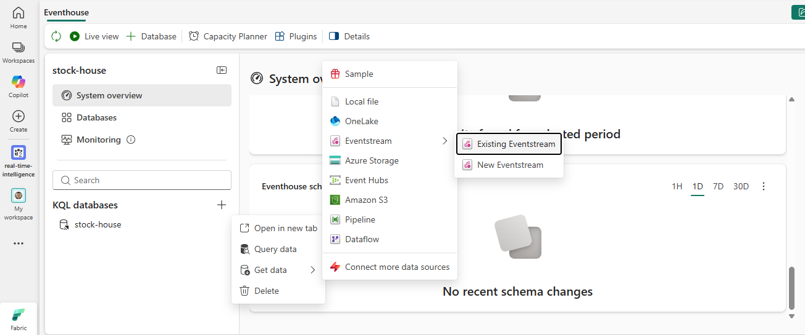

4. **Configuración de la fuente**  
   Como origen elegí **Eventstream > Existing eventstream**. En el panel **Select or create a destination table**, creé una nueva tabla con el nombre **`stock`**.  
   Luego, en **Configure the data source**, seleccioné mi workspace `real_time_intelligence`, el eventstream `stock-data` y el stream `stock-data-stream`. Asigné el nombre **`stock-table`** a la conexión de datos.  
   > 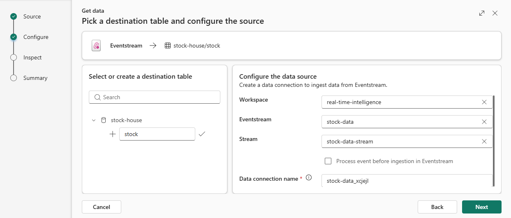

5. **Finalización y verificación**  
   Usé el botón **Next** para inspeccionar los datos y completar la configuración. Cerré la ventana y, al volver al Eventhouse, la tabla **`stock`** ya aparecía listada.  
   > 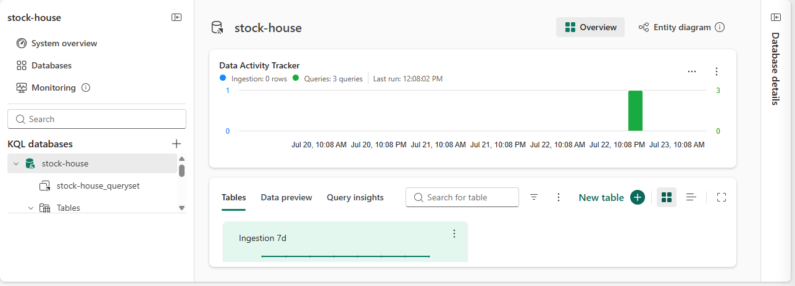

6. **Confirmación en el Real‑Time Hub**  
   Para verificar que el eventstream ahora tenía un destino, fui al **Real‑Time hub**, abrí el menú de opciones del stream `stock-data-stream` y seleccioné **Open eventstream**. En el lienzo de diseño, el stream mostraba un nodo de destino hacia la tabla.  
   Actualicé la vista y comprobé que los datos estaban fluyendo correctamente.  
   > 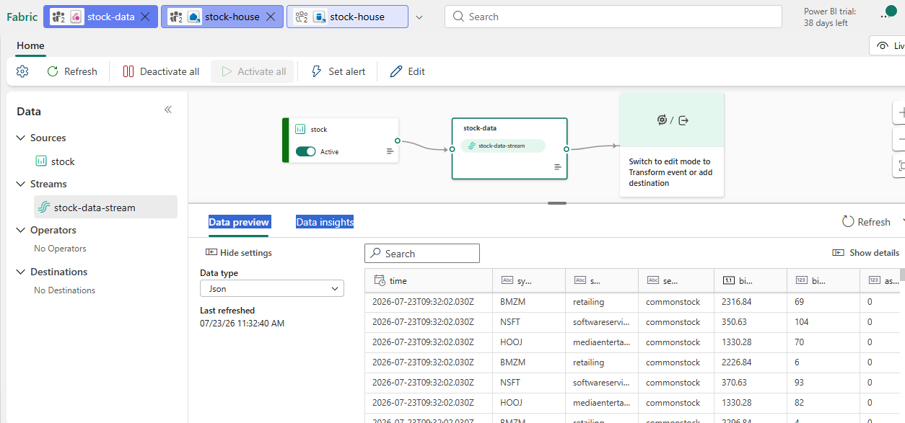

---

**Nota:** Con este Eventhouse ya tengo almacenados los datos en tiempo real en una tabla, lista para ser consultada y analizada con KQL.

## Consulta de datos capturados en el Eventhouse

1. **Acceso a la base de datos KQL**  
   En la barra lateral izquierda, seleccioné el Eventhouse `stock-house` y, dentro de él, hice clic en la base de datos KQL (también llamada `stock-house`). Luego elegí el **queryset** asociado (`stock-house_queryset`) para abrir el editor de consultas.

   > 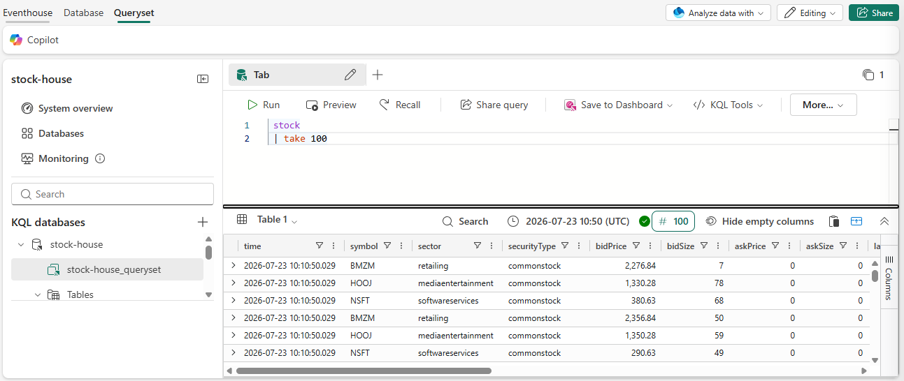

2. **Primera consulta: visualización de datos**  
   En el panel de consultas, reemplacé el código de ejemplo por la siguiente instrucción, que recupera las primeras 100 filas de la tabla `stock`:

   """kql
   stock
   | take 100
   """

   Seleccioné el código y ejecuté la consulta (botón Run). Los resultados mostraron 100 registros con los campos time, symbol, sector, bidPrice, etc., confirmando que la ingesta estaba funcionando.

3. **Segunda consulta: visualización de datos**   
   Segunda consulta: precio promedio por símbolo en los últimos 5 minutos
   Para obtener el precio medio de cotización (bidPrice) de cada acción en el intervalo más reciente, modifiqué el query de la siguiente manera:

   """
   stock
| where ["time"] > ago(5m)
| summarize avgPrice = avg(todecimal(bidPrice)) by symbol
| project symbol, avgPrice
   """

   Ejecuté esta consulta y observé los resultados, que mostraban el promedio para cada símbolo (NSFT, BMZM, HOOJ, etc.) en los últimos 5 minutos.

   > 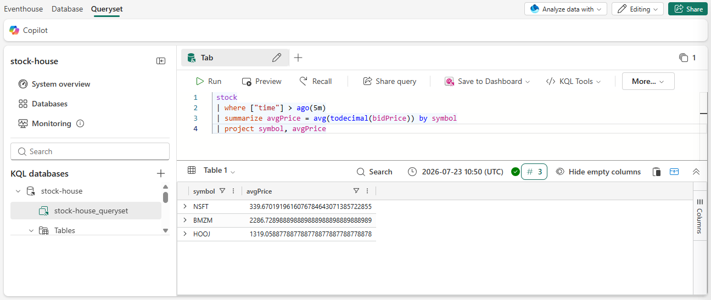

4. **PrActualización en tiempo real**  
   Actualización en tiempo real
   Esperé unos segundos y volví a ejecutar la misma consulta. Comprobé que los valores de avgPrice cambiaban ligeramente, reflejando la llegada de nuevos datos desde el eventstream en tiempo real

   > 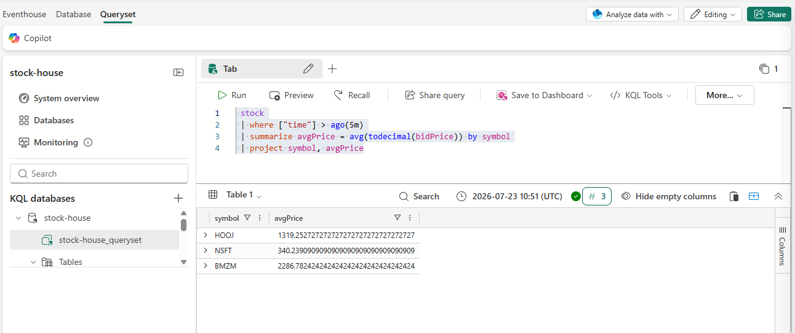

**Nota:**  Con estas consultas pude verificar que los datos se están ingiriendo correctamente y que la tabla se actualiza de forma continua, lo que permite realizar análisis en tiempo real sobre las cotizaciones bursátiles.

## Creación de un dashboard en tiempo real

1. **Selección de la consulta KQL**  
   En el editor de consultas del queryset de `stock-house`, seleccioné la consulta que habíamos creado para calcular el precio promedio por símbolo en los últimos 5 minutos:

stock
| where ["time"] > ago(5m)
| summarize avgPrice = avg(todecimal(bidPrice)) by symbol
| project symbol, avgPrice

(El código anterior se muestra como texto plano para evitar interferencias con el formato Markdown.)

2. **Guardado en un nuevo dashboard**  
En la barra de herramientas del editor, hice clic en **Save to dashboard** y elegí la opción de crear un nuevo dashboard con los siguientes parámetros:  
- **Dashboard name**: `Stock Dashboard`  
- **Tile name**: `Average Prices`  
Confirmé la creación y el dashboard se abrió automáticamente, mostrando una tabla con los símbolos y sus precios promedio.

> 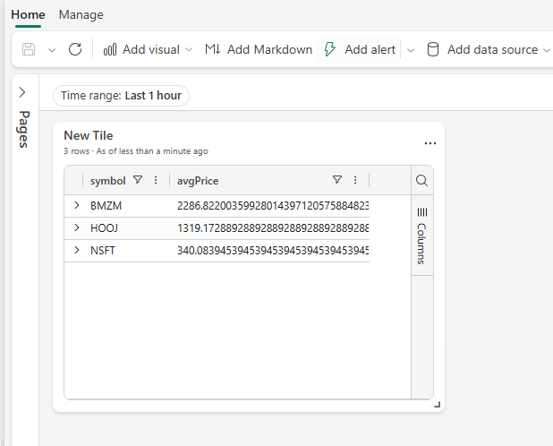

3. **Cambio a modo edición**  
En la esquina superior derecha del dashboard, cambié el modo de **Viewing** a **Editing** para poder modificar el aspecto del tile.

4. **Edición del tile**  
Seleccioné el icono de edición (lápiz) en el tile **Average Prices**. En el panel de **Visual formatting**, cambié el tipo de visual de **Table** a **Column chart**.  
Ajusté los ejes y la apariencia según preferencia (dejé los valores por defecto).  
> 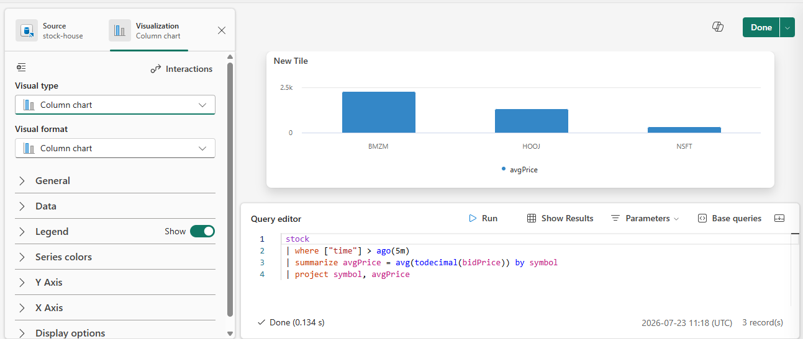

5. **Aplicación de cambios**  
En la parte superior del dashboard, hice clic en **Apply changes** y el tile se actualizó mostrando un gráfico de columnas con los precios promedio de cada símbolo. El dashboard ahora presentaba una visualización en tiempo real de los datos bursátiles.

---

**Nota:** Este dashboard se actualiza automáticamente a medida que nuevos datos llegan al eventstream, permitiendo un monitoreo continuo de las cotizaciones.

## Creación de una alerta con Activator

1. **Acceso a la opción de alerta**  
   Desde el dashboard `Stock Dashboard` que creé anteriormente, localicé la visualización de precios promedio y en la barra de herramientas seleccioné **Set alert** para comenzar a configurar una notificación.

2. **Configuración de los parámetros de la alerta**  
   En el panel **Set alert**, completé los campos según las indicaciones:  
   - **Run query every**: `5 minutes`  
   - **Check**: `On each event grouped by`  
   - **Grouping field**: `symbol`  
   - **When**: `avgPrice`  
   - **Condition**: `Increases by`  
   - **Value**: `100`  
   - **Action**: `Send me an email`  
   - **Save location**:  
     - **Workspace**: `real-time-intelligence`  
     - **Item**: `Create a new item`  
     - **New item name**: Elegí un nombre único, por ejemplo `My activator`.  

   > 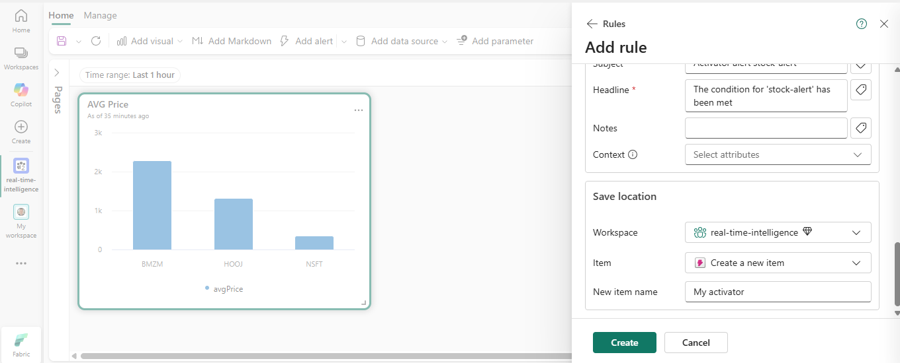

3. **Creación y guardado**  
   Hice clic en **Create** y esperé a que la alerta se guardara correctamente. Luego cerré el panel de configuración.

4. **Verificación en el workspace**  
   En la barra lateral izquierda, navegué a la página de mi workspace (`real-time-intelligence`) y guardé los cambios pendientes del dashboard si se me solicitó. Allí pude visualizar todos los elementos creados durante el laboratorio, incluyendo el activator con el nombre que asigné.

   > 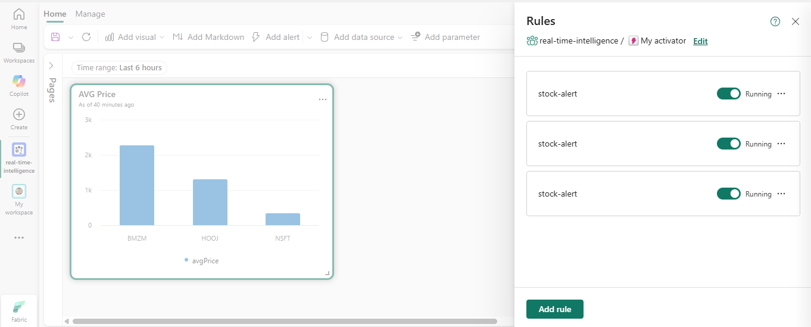

5. **Activacion de alerta**  
   Lleg¡ada de notificaciòn

   > 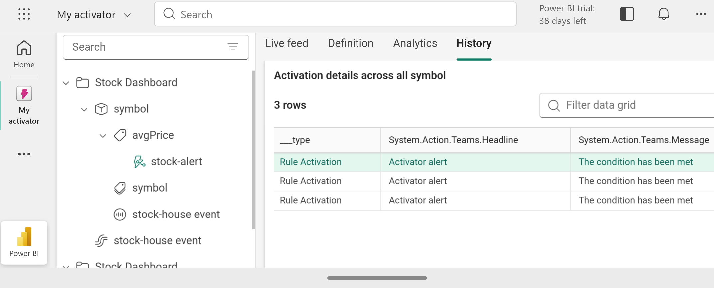

---

**Nota:** Con este activator configurado, el sistema monitoriza continuamente los precios promedio y notifica por correo cuando se produce una variación significativa, permitiendo una respuesta ágil ante cambios en el mercado.